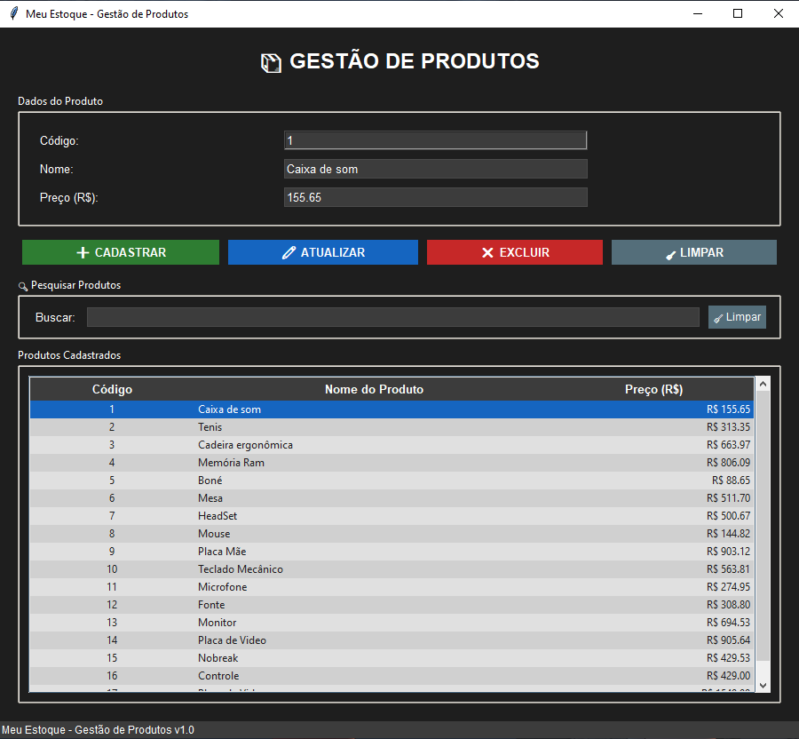

# Sistema de Gestão de Produtos


---

## Sobre o Projeto

Sistema desktop completo para gestão de produtos desenvolvido em Python com interface gráfica Tkinter e banco de dados PostgreSQL. 
O sistema permite realizar operações CRUD (Create, Read, Update, Delete) de forma intuitiva e eficiente.

---

## Demonstração



---

### Funcionalidades

- **Cadastro de produtos** com código automático (ID)
- **Listagem** de todos os produtos em tabela interativa
- **Atualização** de dados dos produtos
- **Exclusão** de produtos com confirmação
- **Pesquisa em tempo real** por código ou nome
- **Ordenação** clicando nos cabeçalhos das colunas
- **Tema escuro** com design moderno e profissional
- **Validação** de dados de entrada
- **Feedback visual** com barra de status
- **Interface responsiva** e redimensionável

---

## Tecnologias Utilizadas

- **Python 3.8+** - Linguagem de programação
- **Tkinter** - Biblioteca gráfica nativa do Python
- **PostgreSQL** - Banco de dados relacional
- **psycopg2** - Adaptador PostgreSQL para Python
- **Faker** - Geração de dados fictícios para testes

---

## Estrutura do Projeto
```
meu-estoque/
│
├── AppGUITeste.py # Interface gráfica principal
├── AppBD.py # Camada de acesso ao banco de dados
├── conectar.py # Configuração da conexão com PostgreSQL
├── cria_tabela.py # Script para criar a tabela no banco
├── gera_dados.py # Script para gerar dados de teste
│
└── README.md # Readme para o GitHub
└── requirements.txt # Dependências do projeto
```

---

## Instalação e Configuração

### Pré-requisitos

- Python 3.8 ou superior instalado
- PostgreSQL instalado e rodando
- Git (opcional)

### Passo a Passo

1. **Clone o repositório**
```bash
git clone https://github.com/seu-usuario/meu-estoque.git
cd meu-estoque
```
2. **Instale as dependências**
```bash
pip install -r requirements.txt
```
3. **Configure o banco de dados PostgreSQL**
```sql
CREATE DATABASE produtos_db;
CREATE USER admin WITH PASSWORD 'admin123';
GRANT ALL PRIVILEGES ON DATABASE produtos_db TO admin;
```
4. **Configure a conexão (arquivo conectar.py)**
```python
import psycopg2

conexao = psycopg2.connect(
    host="localhost",
    database="produtos_db",
    user="admin",
    password="admin123"
)

meu_cursor = conexao.cursor()
```
5. **Crie a tabela**
```bash
python cria_tabela.py
```
6. **(Opcional) Gere dados de teste**
```bash
python gera_dados.py
```
7. **Execute o programa**
```bash
python MeuEstoque.py
```
---

## Autor
#### Gabriel Preé
Estudante de Análise e Desenvolvimento de Sistemas
Projeto desenvolvido para prática de Python com integração com banco de dados e GUI.

## Licença
**Este projeto está sob a licença MIT, código aberto e pode ser usado livremente para fins educacionais.**
